# Rapport de dépannage réseau

## Présentation de l'infrastructure

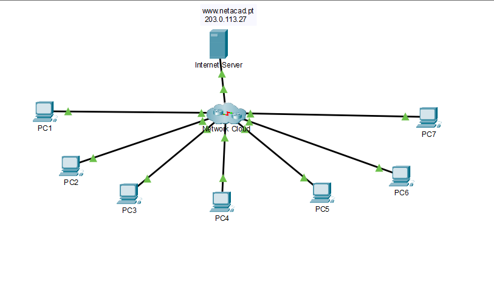

Voici l'infrastructure sur laquelle nous allons opérer. Comme vous pouvez le voir, elle est plutôt simple : une connectivité doit exister entre tous les PC, y compris avec le serveur Internet.

Si l'on clique sur le nœud "cloud", on obtient le détail suivant :

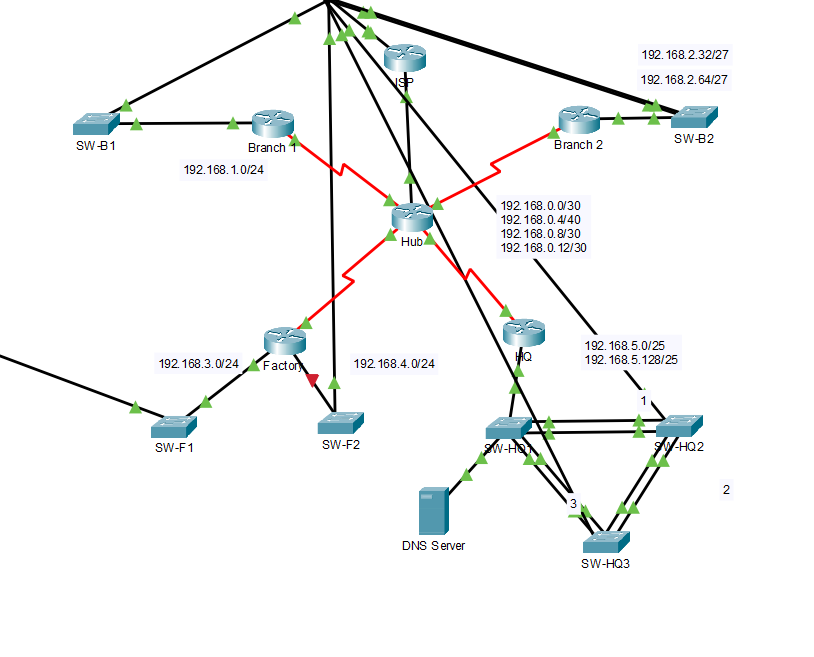

Cela peut paraître intimidant au premier abord, mais l'ensemble reste assez simple à comprendre une fois décomposé. N'oublions pas non plus que le serveur DNS fait partie des hôtes du réseau : il doit donc être fonctionnel lui aussi.

Voici le tableau d'adressage du réseau au tout début de l'intervention. On peut remarquer que PC5 n'a pas de passerelle (gateway) configurée :

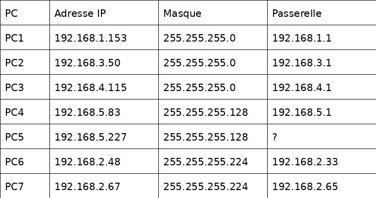

## Étape 1 — Premiers tests de connectivité

Commençons le dépannage en observant les résultats des pings :

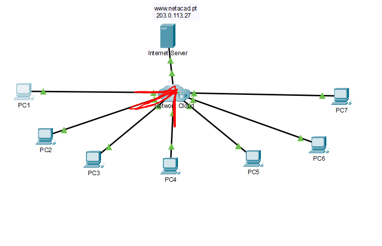

Comme on peut le voir sur le schéma, PC1 n'arrive à ping que PC2 et PC4. Cela signifie qu'il faudra examiner les problèmes de connectivité au niveau des autres hôtes.

En exécutant la commande `tracert`, on remarque que la connectivité vers les autres hôtes, depuis PC1, bloque au niveau de l'IP `192.168.0.1`.

En se connectant à cet équipement par Telnet, on accède donc au Hub (visible sur le schéma), qui constitue le cœur de notre réseau. Cela suggère que le problème est probablement lié au routage.

## Étape 2 — Analyse de la table de routage du Hub

Regardons la table de routage du Hub :

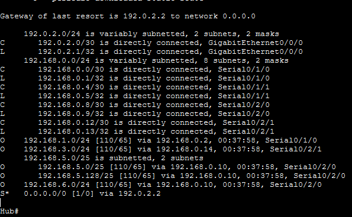

Cette table de routage contient plusieurs informations, mais le premier constat est que les réseaux `192.168.2.x` ne sont pas annoncés, notamment les réseaux de PC6 et PC7.

Notre routeur a bien appris les routes de chaque interface, sauf celles de l'interface `S0/1/1`. Creusons cette piste :

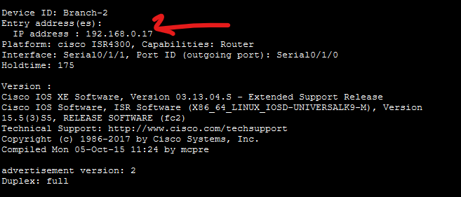

Avec la commande `show cdp neighbor details`, on remarque qu'en face de l'interface `S0/1/1` se trouve un routeur Cisco, qui présente son interface `S0/1/0`. On constate que cette interface n'appartient pas au même réseau que la nôtre : elle semble appartenir au réseau `192.168.0.16/30`.

Ce que l'on va faire, c'est essayer de modifier les informations de `S0/1/1` sur notre routeur, afin de voir si cela résout le problème.

Après modification des informations sur notre routeur, c'est-à-dire :

```
ip address 192.168.0.18 255.255.255.252
```

et après avoir ajouté cette interface au protocole OSPF avec :

```
ip ospf 10 area 0
```

on observe ceci :

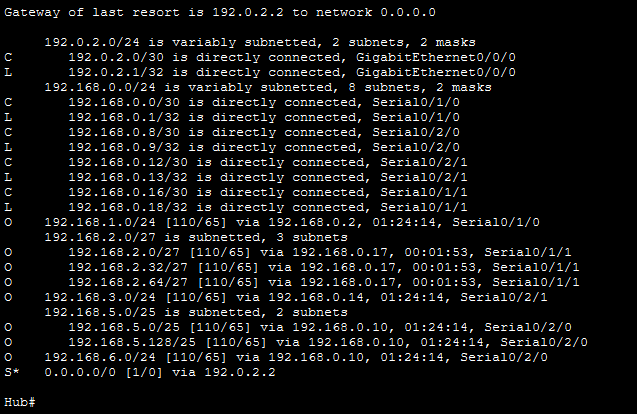

On reçoit désormais bien les routes provenant du routeur Branch-2, et effectivement, le ping fonctionne. En voici la capture :

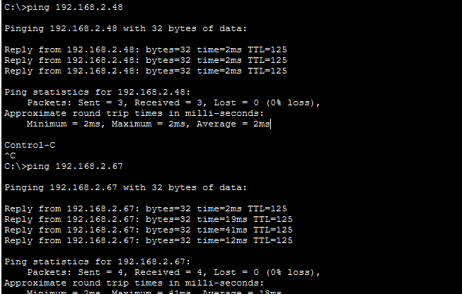

## Étape 3 — Connectivité avec PC5

Pour établir la connectivité avec PC5, regardons la table de routage : on peut voir que l'on possède bien les routes vers PC5. L'hypothèse selon laquelle il suffirait de trouver la passerelle de PC5 et de corriger ses paramètres d'adressage n'est donc pas à négliger.

Toujours à l'aide du protocole CDP, on identifie d'où viennent les routes `192.168.5.x`. On se connecte à ce dernier en Telnet et, avec la commande `show run`, on peut observer les paramètres IP :

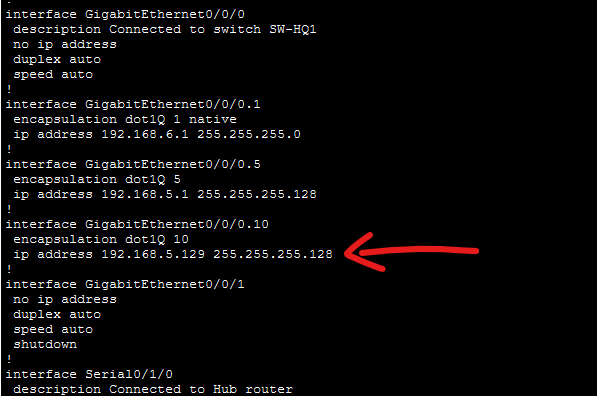

Il suffit donc de bien paramétrer PC5 avec sa passerelle, et le tour est joué.

## Étape 4 — Connectivité avec PC3

En ce qui concerne PC3, il faut se connecter au routeur Factory. Pour remonter à ce routeur, on utilise le protocole CDP, puis on se connecte au routeur de PC3.

On se rend compte qu'il faut corriger les paramètres OSPF, c'est-à-dire :

- sur l'interface dédiée, exécuter :
```
ip ospf 10 area 0
```
- mais aussi, sous `router ospf 10`, ajouter :
```
network 192.168.3.0 0.0.0.255 area 0
```

La route n'était tout simplement pas annoncée.

## Étape 5 — Accès au serveur Internet

À ce stade, tout fonctionne, mais il manque encore l'accès de PC1 au serveur Internet. Jusqu'ici, même les erreurs DNS fonctionnent correctement.

Lorsqu'on effectue à nouveau la commande `tracert`, on se rend compte que le problème vient toujours du Hub. Étant donné que tous les autres hôtes fonctionnent correctement, la raison pour laquelle PC1 n'arrive pas à accéder au serveur Internet est probablement liée à une ACL ou au NAT.

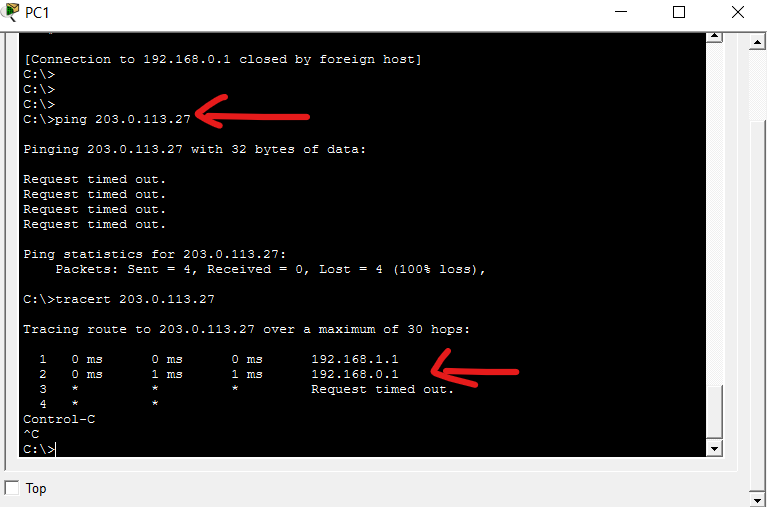

En se connectant au Hub et en regardant de près la sortie de la commande `show ip nat statistics`, on remarque ceci :

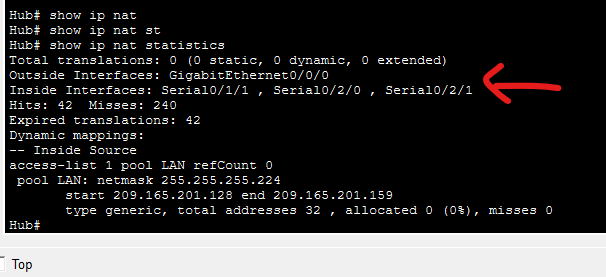

L'interface `S0/1/0`, reliée à PC1, ne fait pas partie des interfaces NAT "inside". En effet, on utilise ici un pool NAT avec surcharge (overload) pour permettre le routage des IP privées vers le réseau public. Il faut donc que l'interface du routeur reliée au LAN de PC1 soit considérée comme une interface "inside" pour que ses adresses puissent être traduites.

Pour corriger cela, il suffit d'entrer la commande suivante en mode de configuration de l'interface `S0/1/1` :

```
ip nat inside
```

Et le tour est joué.

## Conclusion

À ce niveau, tout fonctionne correctement. Ceci marque la fin de notre dépannage réseau. Merci.
